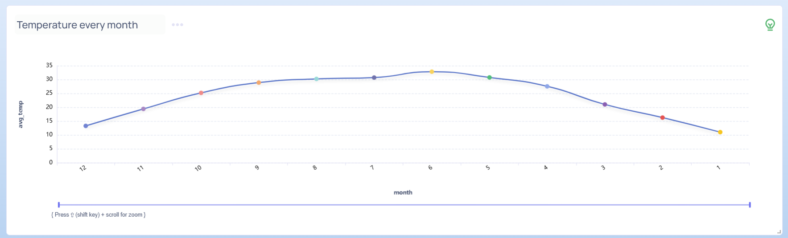
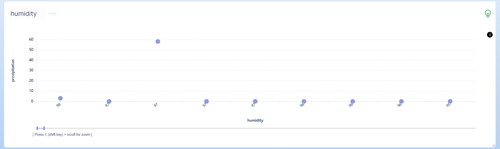
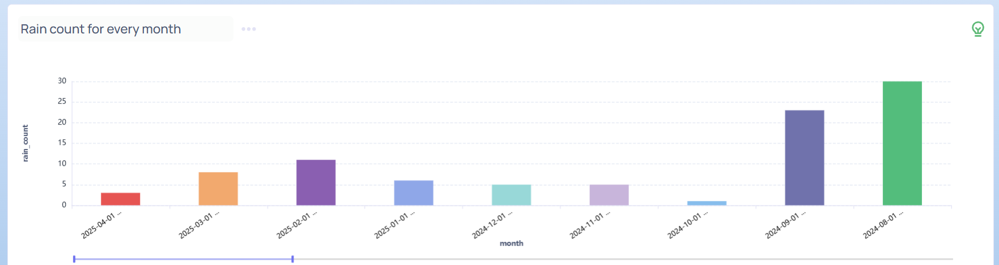

# Weather Prediction

Weather forecasting is a critical component of many industries, including agriculture, transportation, energy, and event planning. Accurate forecasts help organizations make informed decisions, reduce costs, and ensure safety.

## Components

- [ML Model for Weather Forecasting](Base_Model_Training.ipynb)
- [Scheduler for Regular Updates](Daily_Model_Trainer.py)
- [Supaboard Dashboard]
  
  
  
  
  
  
  
  

## Acknowledgements

- [Dataset Provider](https://www.ncei.noaa.gov/cdo-web/)
- [Weather Api](https://www.weatherapi.com)
- [StreamLit for Model Demo](https://streamlit.io)

## Authors

- [@Ichhabal Singh](https://www.github.com/CodeRulerNo1)
